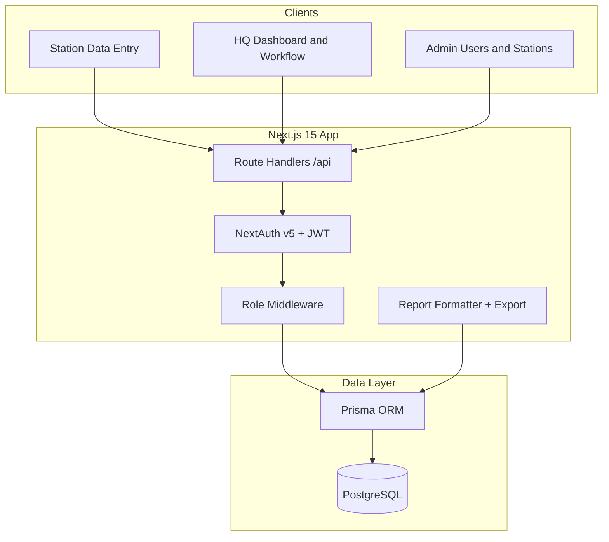

# e-SITREP System — Implementation Plan

## Context

The workspace ([`instructions/`](instructions/)) contains requirements only—**no application code yet**. The problem is clear from [`instructions/support-files/strep system.txt`](instructions/support-files/strep system.txt) and [`instructions/problem-statement.txt`](instructions/problem-statement.txt):

- **60+ border posts** submit daily arrivals/departures (by nationality + gender), asylum seekers, and incidents.
- **HQ** manually compiles them into one **Consolidated Daily SITREP** (compressed nationality lines) and a **Weekly Excel** (stations × days).
- Goal: automate entry → review → approve → generate reports with audit trail and RBAC.

**MVP scope (realistic for showcase):** Core + HQ workflow + report exports. Defer **offline PWA sync**, Keycloak SSO, and Kubernetes to Phase 2.

---

## Technology choice (evaluated before approval)

Four stacks were compared against e-SITREP requirements: complex editable tables, multi-role workflow, PostgreSQL, PDF/Excel exports, June 2026 prototype deadline, and alignment with your instruction docs.

### Comparison matrix

| Criterion | Next.js + TypeScript | Java Spring Boot | PHP Laravel | Python Django |
|-----------|---------------------|------------------|-------------|---------------|
| **Speed to working MVP (solo)** | Excellent — one repo, UI + API together | Slow — typically React SPA + separate API, heavy boilerplate | Good — full-stack in one project (Blade/Inertia/Livewire) | Good — admin fast, but rich tables need separate React SPA |
| **Match to your docs** | Best — React, TypeScript, TanStack Table named in [`technicals.txt`](instructions/technicals.txt), [`AI.instrcutions.txt`](instructions/AI.instrcutions.txt) | Partial — backend-only fit; frontend still React | Partial — strong backend; UI stack differs unless Inertia+React added | Partial — Python not listed in submission technicals |
| **Complex nationality tables (UI)** | Best — TanStack Table + React state, native fit | Requires separate React frontend anyway | Good with Inertia.js + React, or Livewire (less ideal for spreadsheet-style grids) | Poor with Django templates; needs React SPA alongside |
| **PDF + Excel exports** | Good — `exceljs`, `@react-pdf/renderer` or Puppeteer | Excellent — Apache POI, iText/Flying Saucer | Excellent — Maatwebsite Excel, DomPDF/Snappy | Excellent — openpyxl, WeasyPrint/ReportLab |
| **RBAC + audit trail** | Good — NextAuth + app-layer permissions | Excellent — Spring Security | Excellent — Spatie Permission | Excellent — Django Guardian / custom |
| **Gov / enterprise credibility** | High (modern digital gov stacks) | Highest (common in large ministries) | High (widely hosted in Uganda) | High (data/analytics teams) |
| **PWA / offline (Phase 2)** | Best — built into Next.js | Harder — needs separate service worker app | Possible — Laravel PWA packages | Possible — separate PWA layer |
| **PostgreSQL + schema in docs** | Excellent — Prisma maps directly to [`sample_schem.txt`](instructions/sample_schem.txt) | Excellent — JPA/Hibernate | Excellent — Eloquent migrations | Excellent — Django ORM |
| **Maintainability for you** | Single language (TypeScript) end-to-end | Java + TypeScript (two ecosystems) | PHP + possibly React | Python + possibly React |
| **Deploy for showcase demo** | Easiest — Vercel/Railway/Docker one container | Heavier — JVM + DB + static frontend | Easy — shared hosting or Docker | Easy — Docker |

### Scores (weighted for this project)

| Stack | Prototype speed | UI fit | Docs alignment | Enterprise | **Total fit** |
|-------|----------------|--------|----------------|------------|---------------|
| **Next.js + TypeScript** | 10 | 10 | 10 | 7 | **37** — recommended |
| Laravel | 8 | 7 | 6 | 8 | 29 |
| Django | 7 | 5 | 5 | 8 | 25 |
| Spring Boot | 5 | 6 | 5 | 10 | 26 |

### Recommendation: **Next.js 15 + TypeScript + Prisma + PostgreSQL**

**Why this wins for e-SITREP:**

1. **Deadline (1 June 2026)** — You need a demo fast as a solo innovator. Next.js delivers UI, API, and auth in one codebase; Spring Boot or Django+React effectively doubles setup time.
2. **Core UI is the product** — The hardest part is dynamic Arrivals/Departures grids, not CRUD. React + TanStack Table is specified in your own docs and is the right tool for spreadsheet-like entry.
3. **Instructions already point here** — [`AI.instrcutions.txt`](instructions/AI.instrcutions.txt) is a full Next.js + Prisma plan; [`technicals.txt`](instructions/technicals.txt) lists React + TypeScript as primary languages.
4. **Report engine is logic, not language** — Consolidated string formatting (`235 ARRIVALS: 01 BI, ...`) is plain TypeScript; Excel/PDF libraries are mature on Node.
5. **Future path is clear** — If NCIC later mandates Java, the PostgreSQL schema and API contracts transfer to Spring Boot; the React UI can remain.

**When to choose another stack instead:**

| If this is true… | Consider instead |
|------------------|------------------|
| NCIC / MoICT mandates Java for all new systems | **Spring Boot** API + keep React frontend (or Thymeleaf only if HQ accepts simpler UI) |
| Your team is strongest in PHP and hosts on LAMP | **Laravel 11** + Inertia.js with React for tables |
| Heavy analytics / ML on reports is Phase 1 priority | **Django** API for aggregation + React frontend |

**Not recommended for MVP:** Spring Boot or Django as *monolithic server-rendered only* — the nationality grid UX will fight you and delay the showcase.

### Approved stack (locked for implementation)

```
Frontend + API:  Next.js 15 (App Router) + TypeScript
UI:              React + TanStack Table + shadcn/ui + Tailwind
ORM:             Prisma
Database:        PostgreSQL 16
Auth:            NextAuth.js v5 (credentials; SSO-ready later)
Exports:         exceljs (weekly), @react-pdf/renderer (daily PDF)
Deploy:          Docker Compose (local demo); optional Railway/Render
```

Submission wording: *"TypeScript, React.js, Node.js (Next.js), PostgreSQL"* — accurate and matches [`technicals.txt`](instructions/technicals.txt) without claiming NestJS unless you later split the API.

---

## Target architecture



---

## Data model (source of truth)

Implement the schema from [`instructions/sample_schem.txt`](instructions/sample_schem.txt) as **Prisma models** in `prisma/schema.prisma`:

| Model | Purpose |
|-------|---------|
| `BorderStation` | 60+ posts (code, name, cluster, type) |
| `User`, `Role`, `Permission`, `UserRole`, `RolePermission` | RBAC per [`instructions/RBAC.txt`](instructions/RBAC.txt) |
| `StationDailyReport` | One per station per day; status workflow |
| `Movement` | arrival/departure × nationality × male/female |
| `SpecialCategory` | asylum_seekers, deported, etc. |
| `Incident` | deportations, downtime, denials |
| `AuditLog` | CREATE/UPDATE/SUBMIT/APPROVE |

**Statuses:** `draft` → `submitted` → `reviewed` → `verified` → `approved` (reject returns to `draft`).

**RLS simulation:** Enforce in API layer (not raw DB RLS for MVP): station users filtered by `user.stationId`; HQ roles see all. Add PostgreSQL RLS policies in a later migration if deploying to gov infra.

**Seed data:** 5 stations (ENT, BUS, ELE, MAL, MPO) + 6 roles + demo users + 2–3 days of sample reports mirroring Elegu numbers from [`instructions/support-files/strep system.txt`](instructions/support-files/strep system.txt).

---

## Report generation (core innovation)

### Consolidated daily line format

For each station, after approval, format movements like the manual HQ extract:

```
235 ARRIVALS: 01 BI, 17 ER (01 FE), 70 KE (04 FE), 01 RW, 122 SSD (43 FE), ...
223 DEPARTURES: 04 BI, 09 ER (01 FE), ...
55 ASYLUM SEEKERS
```

**Formatter rules** (`lib/reports/consolidated-formatter.ts`):

1. Group `Movement` rows by `movement_type` + `nationality_code`.
2. Sum male/female; total = male + female.
3. Output `{total} {CODE}`; append `(NN FE)` only when `female > 0`.
4. Pad counts to 2 digits where manual samples use `01` style.
5. Sort nationalities by total descending (or fixed ISO order—match sample PDFs when available).
6. Append `SpecialCategory` (asylum) and `Incident` / remarks blocks.

### Exports

| Output | Library | Route |
|--------|---------|-------|
| Station daily PDF | `@react-pdf/renderer` | `GET /api/exports/station/[reportId]/pdf` |
| Consolidated national PDF | same + multi-station template | `POST /api/reports/generate/consolidated?date=` |
| Weekly Excel matrix | `exceljs` | `GET /api/exports/weekly?from=&to=` |

Weekly sheet: rows = stations, columns = Mon–Sun (or date range), cells = arrival totals (and optional departure sheet); footer row = grand totals—per [`instructions/manual.txt`](instructions/manual.txt).

---

## Application structure

```
e-sitrep/
├── app/
│   ├── (auth)/login/
│   ├── (dashboard)/
│   │   ├── station/reports/[date]/     # Data entry form
│   │   ├── hq/inbox/                   # Pending reports
│   │   ├── hq/consolidated/            # Generate preview
│   │   ├── weekly/                     # Weekly export UI
│   │   └── admin/users|stations/
│   └── api/
│       ├── auth/[...nextauth]/
│       ├── stations/
│       ├── reports/daily/
│       ├── reports/[id]/{submit,review,verify,approve,reject}
│       ├── reports/generate/consolidated/
│       └── exports/{station,weekly}/
├── components/
│   ├── forms/MovementTable.tsx         # TanStack Table, dynamic rows
│   ├── reports/ConsolidatedPreview.tsx
│   └── ui/                             # shadcn
├── lib/
│   ├── prisma.ts
│   ├── auth.ts
│   ├── rbac.ts                         # can(user, permission)
│   └── reports/
├── prisma/schema.prisma
├── docker-compose.yml                  # postgres + app
└── docs/                               # architecture, user manual stubs
```

---

## Implementation phases

### Phase 0 — Scaffold (Day 1)

- `npx create-next-app@latest` with TypeScript, Tailwind, App Router, ESLint.
- Install: `prisma`, `@prisma/client`, `next-auth@beta`, `bcryptjs`, `@tanstack/react-table`, `date-fns`, `exceljs`, `@react-pdf/renderer`, `lucide-react`, shadcn/ui.
- `docker-compose.yml` with PostgreSQL 16.
- `.env.example` with `DATABASE_URL`, `NEXTAUTH_SECRET`.

### Phase 1 — Database and seed (Days 1–2)

- Convert [`instructions/sample_schem.txt`](instructions/sample_schem.txt) to Prisma schema.
- `prisma db push` + seed script: stations, roles, permissions map, demo users (one per role).
- Nationality master list (BI, KE, SSD, UG, ER, RW, SD, TZ, USA, etc.) as `Nationality` table or const in `lib/constants/nationalities.ts`.

### Phase 2 — Auth and RBAC (Days 2–3)

- NextAuth credentials provider; password hash via bcrypt.
- `lib/rbac.ts`: map roles → permissions from [`instructions/RBAC.txt`](instructions/RBAC.txt).
- Middleware: protect `(dashboard)` routes; redirect by role (station → `/station`, HQ → `/hq`, admin → `/admin`).
- API guards: `requirePermission('report.approve')` etc.

### Phase 3 — Station data entry (Days 3–5) — highest priority UI

Build form mirroring Busia/Elegu samples:

- **Arrivals table**: add row per nationality; columns Male, Female, auto Total.
- **Departures table**: same pattern.
- **Special categories**: asylum seekers (male/female).
- **Incidents**: type, description, passport, action.
- **Remarks**: staff on duty, medical screening, general, urgent.
- Save as `draft`; **Submit** → `submitted` + audit log.
- Validation: non-negative integers; optional warning if station totals mismatch row sums.

Use **TanStack Table** for editable grid behavior.

### Phase 4 — HQ workflow (Days 5–7)

- Inbox: filter `status = submitted|reviewed|verified`.
- Actions per [`instructions/workflow.txt`](instructions/workflow.txt):
  - Reviewer: comment + `reviewed`
  - Verifier: `verified`
  - Authoriser: `approved`
- Reject → `draft` with comment notification (in-app toast; email optional later).

### Phase 5 — Report engine (Days 7–10)

- `lib/reports/consolidated-formatter.ts` — unit-test against Elegu sample strings.
- Consolidated preview page (all approved stations for date).
- PDF templates matching government tabular layout (station blocks stacked).
- Weekly Excel generator from approved `StationDailyReport` + `Movement` aggregates.

### Phase 6 — Admin and polish (Days 10–12)

- Admin: CRUD users, assign `stationId` + roles; manage stations.
- Dashboard cards: pending count, today’s submission rate, top stations by volume.
- Audit log viewer (admin only).

### Phase 7 — Demo readiness (Days 12–14)

- `docker compose up` one-command local demo.
- README: setup, demo credentials, walkthrough script.
- `docs/architecture.md` + role-based user manual excerpts from [`instructions/api.txt`](instructions/api.txt).
- Optional: deploy to Railway/Render for live showcase URL.

---

## API surface (MVP)

Align with [`instructions/api.txt`](instructions/api.txt):

| Method | Endpoint | Role |
|--------|----------|------|
| POST | `/api/auth/login` | public |
| GET | `/api/stations` | authenticated |
| GET/POST/PATCH | `/api/reports/daily` | station inputter (own station) |
| POST | `/api/reports/[id]/submit` | station inputter |
| POST | `/api/reports/[id]/review` | HQ reviewer |
| POST | `/api/reports/[id]/verify` | HQ verifier |
| POST | `/api/reports/[id]/approve` | HQ authoriser |
| POST | `/api/reports/generate/consolidated` | HQ authoriser |
| GET | `/api/exports/station/[id]/pdf` | station (own) / HQ (all) |
| GET | `/api/exports/weekly` | HQ / admin |

---

## Deferred to Phase 2 (post-MVP)

- Offline PWA + IndexedDB sync ([`instructions/proposal.txt`](instructions/proposal.txt))
- Keycloak / National ID SSO
- Materialized views + `REFRESH` job for weekly perf
- PISCES/MIDAS integration stubs
- Kubernetes manifests, Prometheus/Grafana
- Anomaly detection / AI summaries

---

## Showcase deliverables checklist

| Item | Source doc |
|------|------------|
| Live demo with Elegu/Busia sample data | [`instructions/manual.txt`](instructions/manual.txt) |
| Consolidated SITREP matching current PDF format | [`instructions/support-files/strep system.txt`](instructions/support-files/strep system.txt) |
| Weekly Excel export | proposal + manual |
| Architecture diagram + ERD | workflow.txt appendices |
| 3–5 min demo video script | proposal.txt |
| Thematic areas for submission | [`instructions/thematic-mapping.txt`](instructions/thematic-mapping.txt) |

---

## Risk mitigations

| Risk | Mitigation |
|------|------------|
| Exact PDF layout unknown | Start with consolidated **text preview**; iterate PDF CSS against a sample PDF if you add one to `instructions/support-files/` |
| Scope creep (offline, K8s) | Strict MVP boundary above |
| Stack mismatch in submission | Use approved wording: TypeScript, React, Node.js (Next.js), PostgreSQL — see Technology choice section |
| Wrong stack for team skills | If you are stronger in PHP/Java/Python, say so before approval — plan can switch to Laravel/Spring/Django runner-up |
| Solo timeline | Build station form + consolidated formatter first; workflow can use simplified "approve" if time runs short |

---

## First execution steps (after plan approval)

1. Initialize Next.js app in repo root (or `apps/web/` if you prefer monorepo later).
2. Add `docker-compose.yml` + Prisma schema from `sample_schem.txt`.
3. Run migrations and seed Elegu demo data.
4. Implement auth + one station report form end-to-end before HQ UI.
