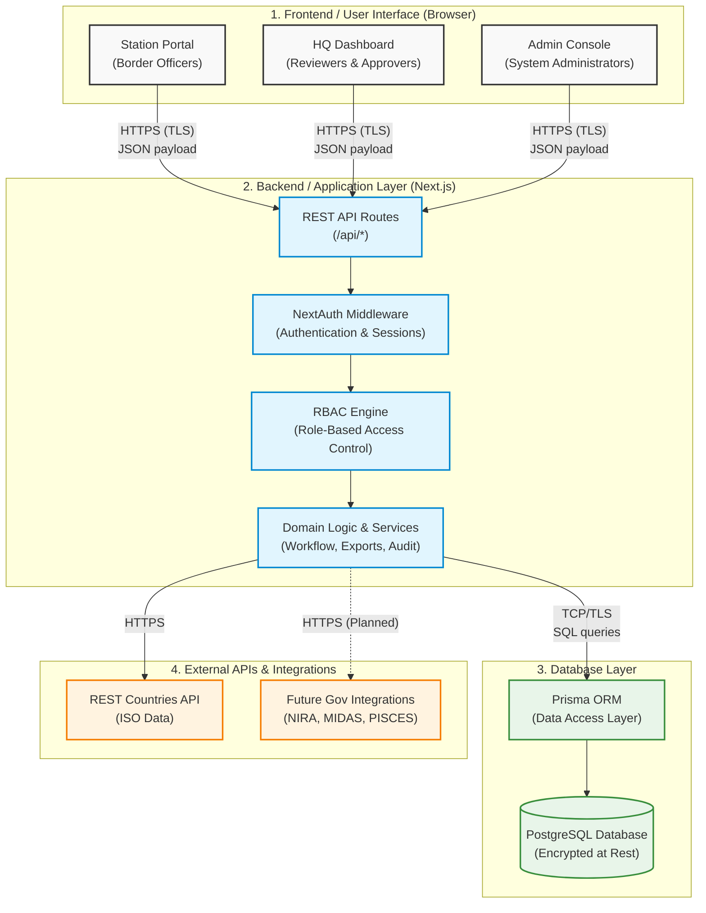

# e-SITREP System — System Architecture Diagram
**Ministry of ICT and National Guidance (MoICT&NG)**
**Government Systems Prototype Showcase Submission**

---

The diagram below visualizes the primary components of the e-SITREP system, demonstrating the flow of data from the end-user interface down to the database and external integrations.

