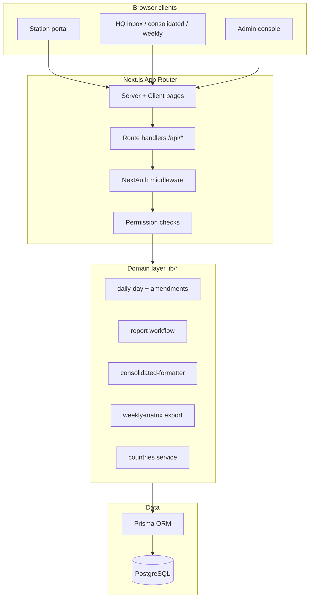
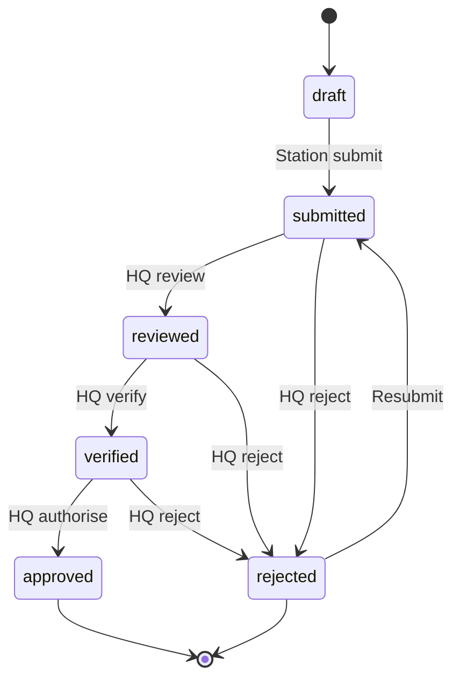

# e-SITREP System — A–Z Documentation

**Electronic Situation Report (SITREP) Automation System**  
National Citizenship and Immigration Control (NCIC), Ministry of Internal Affairs — Uganda

| Document | Version |
|----------|---------|
| System | MVP (Next.js 16) |
| Last updated | May 2026 |
| Audience | Developers, HQ staff, station operators, administrators |
| Short guide (≤5 pages) | [`SYSTEM_GUIDE.md`](./SYSTEM_GUIDE.md) |

---

## Table of contents

1. [Introduction](#1-introduction)
2. [Business context](#2-business-context)
3. [System goals](#3-system-goals)
4. [Architecture overview](#4-architecture-overview)
5. [Technology stack](#5-technology-stack)
6. [Installation and setup](#6-installation-and-setup)
7. [Environment variables](#7-environment-variables)
8. [Database design](#8-database-design)
9. [Roles and permissions (RBAC)](#9-roles-and-permissions-rbac)
10. [Authentication and sessions](#10-authentication-and-sessions)
11. [Reporting profiles: land vs air](#11-reporting-profiles-land-vs-air)
12. [Station daily data entry](#12-station-daily-data-entry)
13. [Day report lifecycle](#13-day-report-lifecycle)
14. [Amendments and locked days](#14-amendments-and-locked-days)
15. [Nationality and country codes](#15-nationality-and-country-codes)
16. [HQ inbox and workflow](#16-hq-inbox-and-workflow)
17. [Consolidated daily SITREP](#17-consolidated-daily-sitrep)
18. [Weekly statistics export](#18-weekly-statistics-export)
19. [Admin console](#19-admin-console)
20. [REST API reference](#20-rest-api-reference)
21. [Web application routes](#21-web-application-routes)
22. [Project structure](#22-project-structure)
23. [Core modules](#23-core-modules)
24. [Audit logging](#24-audit-logging)
25. [Demo data and testing](#25-demo-data-and-testing)
26. [Operations and deployment](#26-operations-and-deployment)
27. [Security model](#27-security-model)
28. [Known limitations and phase 2](#28-known-limitations-and-phase-2)
29. [Glossary](#29-glossary)
30. [Quick reference](#30-quick-reference)

---

## 1. Introduction

The **e-SITREP System** replaces manual compilation of border situation reports. Officers at **60+ border posts** record daily movements (arrivals, departures, asylum seekers, airport-specific cases). Headquarters (HQ) reviews, verifies, and approves data, then generates:

- **Per-station daily reports** (tabular, by nationality and gender)
- **National consolidated daily SITREP** (compressed nationality lines per station)
- **Weekly Excel matrix** (stations × days, arrivals and departures)

All changes run through a **role-based workflow** with an **audit trail**.

---

## 2. Business context

### 2.1 The manual process (before automation)

1. Each border post sends a daily report (often by 14:00) with arrivals/departures by nationality, asylum seekers, and incidents.
2. HQ manually aggregates all posts into one **Consolidated Daily SITREP**.
3. Weekly, HQ builds an **Excel matrix**: rows = stations, columns = each day’s arrivals and departures.

This is slow, error-prone, and hard to audit.

### 2.2 Reference documents

Sample formats and requirements live under [`instructions/`](../instructions/):

| Asset | Purpose |
|-------|---------|
| `support-files/strep system.txt` | Elegu sample + HQ extract format |
| `support-files/SIT_REP 08.05.2026 DAILY REPORT SAMPLE.pdf` | Station PDF layout |
| `support-files/WEEKLY STATISTICS 02.08 MAY 2026.xlsx` | Weekly matrix layout |
| `support-files/ENTEBBE REPORT 7th MAY to 8th MAY 2026.pdf` | Airport-specific report |
| `sample_schem.txt`, `RBAC.txt`, `workflow.txt` | Schema and process notes |

---

## 3. System goals

| Goal | How the system addresses it |
|------|-----------------------------|
| Accurate station entry | One calendar day per station; incremental batches; running totals |
| HQ quality control | draft → submitted → reviewed → verified → approved |
| Locked data after submit | Amendments queue for non-admin edits |
| National consolidated output | Formatter matches NCIC compressed lines |
| Weekly reporting | Excel export aligned with NCIC weekly statistics |
| Airport vs land differences | `reportingProfile`: land (nationality) vs air (flights, deportees, etc.) |
| Accountability | `audit_logs` on reports, entries, amendments |
| Multi-user preferences | Display alpha-2/alpha-3; storage always ISO alpha-2 |

---

## 4. Architecture overview



### 4.1 Design principles

- **One report per station per calendar day** (`station_daily_reports` unique on `stationId + reportDate`).
- **Append-only style entry log** during the day (`daily_entries` with `recordedAt`).
- **Server-side validation** for entry types, country codes, and workflow transitions.
- **Thin API routes**; business logic in `lib/`.

---

## 5. Technology stack

| Layer | Technology |
|-------|------------|
| Framework | Next.js 16 (App Router) |
| Language | TypeScript 5 |
| UI | React 19, Tailwind CSS 4 |
| Auth | NextAuth v5 (credentials provider) |
| ORM | Prisma 6 |
| Database | PostgreSQL 16 (Docker locally) |
| Excel | ExcelJS |
| Countries | REST Countries API (cached server-side) |
| Package manager | pnpm 10 |

---

## 6. Installation and setup

### 6.1 Prerequisites

- Node.js 20+
- Docker Desktop (for PostgreSQL)
- pnpm (`corepack enable` optional)

### 6.2 First-time setup

```bash
git clone <repository-url>
cd e-sitrep-System
cp .env.example .env
# Edit .env — set AUTH_SECRET (see section 7)

docker compose up -d
pnpm install
pnpm db:push
pnpm db:seed
pnpm dev
```

Open **http://localhost:3000** and sign in with a demo account (section 25).

### 6.3 Ongoing development

| Command | Action |
|---------|--------|
| `pnpm dev` | Start dev server |
| `pnpm build` | Production build + typecheck |
| `pnpm db:push` | Apply schema changes |
| `pnpm db:seed` | Reset seed data (stations, users, samples) |
| `pnpm db:studio` | Prisma Studio GUI |
| `pnpm test:formatter` | Validate Elegu consolidated strings |

After schema changes, run:

```bash
pnpm exec prisma generate
```

---

## 7. Environment variables

| Variable | Required | Description |
|----------|----------|-------------|
| `DATABASE_URL` | Yes | PostgreSQL connection string |
| `AUTH_SECRET` | Yes | NextAuth signing secret (`openssl rand -base64 32`) |
| `AUTH_TRUST_HOST` | Yes (dev) | `true` for local/proxy hosts |
| `NEXTAUTH_URL` | Yes | App base URL, e.g. `http://localhost:3000` |
| `REST_COUNTRIES_URL` | No | Override REST Countries endpoint (default: v3.1 all) |

Example: see [`.env.example`](../.env.example).

---

## 8. Database design

### 8.1 Entity relationship (conceptual)

```
border_stations ──┬── users
                  └── station_daily_reports ──┬── daily_entries
                                              ├── incidents
                                              └── day_amendments

roles ── role_permissions ── permissions
users ── user_roles ── roles
users ── audit_logs
```

### 8.2 Core tables

#### `border_stations`

| Field | Description |
|-------|-------------|
| `code` | Short code (e.g. `ELE`, `ENT`) |
| `name` | Display name (e.g. `ELEGU`, `ENTEBBE`) |
| `cluster` | Regional grouping |
| `type` | e.g. `Land`, `Air`, `Water` |
| `reportingProfile` | `land` or `air` — drives UI and totals logic |
| `active` | Included in lists/exports when true |

#### `station_daily_reports`

One row per **station + calendar date**.

| Field | Description |
|-------|-------------|
| `reportDate` | Calendar day (date only) |
| `status` | Workflow state (enum) |
| `staffOnDuty` | Headcount on duty |
| `medicalScreening` | Text (land posts) |
| `generalRemarks` | End-of-day remarks |
| `urgentMatters` | Matters requiring HQ attention |
| `inadmissibleCount` | Airport: inadmissible passengers count |
| `staffLeaveNotes` | Airport: staff on leave by shift |
| `submittedById` / `submissionTime` | Set on submit |

#### `daily_entries`

Incremental batches during the day.

| Field | Used for |
|-------|----------|
| `entryType` | See section 11 |
| `nationalityCode` | Land movements; optional on person cases (stored **alpha-2**) |
| `male`, `female` | Person counts (land) or passenger count (air: `male` only) |
| `flightNumber`, `route`, `shift` | Air: flight movements (`shift` = `B` night / `D` day) |
| `passportNo`, `personName` | Deportees, offloaded, denied |
| `recordedAt` | When the batch was logged |
| `notes` | Free text |

#### `day_amendments`

Queued corrections when a day is **locked** (submitted or later).

| Field | Description |
|-------|-------------|
| `action` | `add_entry`, `delete_entry`, `update_entry` |
| `payload` | JSON with proposed change |
| `reason` | Inputter’s justification |
| `status` | `pending`, `approved`, `rejected` |
| `targetEntryId` | For update/delete |

#### `incidents`

Narrative **occurrences** (especially Entebbe day/night shifts).

#### `audit_logs`

Append-only log: `action`, `entityType`, `entityId`, `oldValues`, `newValues`, `userId`, timestamp.

### 8.3 Enums

**`ReportStatus`:** `draft` → `submitted` → `reviewed` → `verified` → `approved` (or `rejected`)

**`DailyEntryType`:**

| Land | Air (Entebbe) |
|------|----------------|
| `arrival` | `flight_arrival` |
| `departure` | `flight_departure` |
| `asylum_seeker` | `deportee` |
| `refugee` | `returned_person` |
| | `offloaded` |
| | `denied_entry` |

**`ReportingProfile`:** `land` | `air`

---

## 9. Roles and permissions (RBAC)

### 9.1 Roles

| Role | Typical user | Primary function |
|------|--------------|------------------|
| `STATION_INPUTTER` | Border post officer | Enter data for **assigned station only** |
| `CLUSTER_SUPERVISOR` | Regional supervisor | Review + station input (MVP scope) |
| `HQ_REVIEWER` | HQ | Review submitted reports |
| `HQ_VERIFIER` | HQ | Verify reviewed reports; consolidated + weekly |
| `HQ_AUTHORISER` | HQ | Approve verified reports |
| `ADMIN` | ICT / system admin | Users, stations, full access |

### 9.2 Permissions

| Permission | Key |
|------------|-----|
| Station input | `station.input` |
| Review | `report.review` |
| Verify | `report.verify` |
| Approve | `report.approve` |
| Consolidated SITREP | `report.generate.consolidated` |
| Weekly Excel | `weekly.export` |
| Admin users/stations | `admin.users` |

Defined in [`lib/rbac.ts`](../lib/rbac.ts). Session user carries `roles[]` and `permissions[]`.

### 9.3 Home route by role

| Roles | Landing after login |
|-------|---------------------|
| `ADMIN` | `/admin` |
| Any `HQ_*` | `/hq/inbox` |
| Station roles | `/station` |

---

## 10. Authentication and sessions

- **Provider:** Credentials (username + password, bcrypt hash in `users.password_hash`).
- **Config:** [`auth.config.ts`](../auth.config.ts), [`auth.ts`](../auth.ts).
- **Middleware:** [`middleware.ts`](../middleware.ts) — unauthenticated users redirected to `/login`; public paths: `/`, `/login`, `/api/auth/*`.
- **Session:** JWT-based (NextAuth v5); user id, roles, permissions, `stationId` embedded for API checks.

Station inputters **must** have `stationId` set on their user record.

---

## 11. Reporting profiles: land vs air

Stations have `reportingProfile` on `border_stations` (default `land`). **Entebbe (`ENT`)** uses `air`.

| Aspect | Land (`land`) | Air (`air`) |
|--------|---------------|-------------|
| UI component | `DayRecordWorkspace` | `EntebbeDayWorkspace` |
| Router | `DayRecordRouter` picks by profile | |
| Arrivals/departures | Nationality + male/female batches | Flight no., route, passenger count, shift B/D |
| Special categories | Asylum seekers, refugees | Deportees, returned, offloaded, denied |
| Extra day fields | Medical screening | Inadmissible count, staff on leave |
| Occurrences | Optional via incidents | Dedicated **Occurrences** tab |
| Weekly export totals | `arrival` / `departure` entry types | `flight_arrival` / `flight_departure` |

Config: [`lib/station/entry-config.ts`](../lib/station/entry-config.ts), validation: [`lib/station/validate-entry.ts`](../lib/station/validate-entry.ts).

---

## 12. Station daily data entry

### 12.1 Navigation

**Station entry** (`/station`):

- **Today** — current calendar date for the user’s station.
- **Previous days** — year/month filters, paginated list; open any day in a drawer layout.

### 12.2 Land post workspace tabs

| Tab | Purpose |
|-----|---------|
| New entry / Edit entry | Add or edit a batch |
| Entry log | Chronological list; edit/remove |
| Day totals | Aggregated arrivals, departures, asylum/refugee |
| Submit day / Modify day | Remarks, staff on duty; **submit once** to HQ |

### 12.3 Air post (Entebbe) workspace tabs

| Tab | Purpose |
|-----|---------|
| New record | Modules: Flights, Deportees & returned, Offloaded & denied |
| Activity log | Entries + occurrences |
| Occurrences | Day/night shift narratives |
| Day totals | Flight passenger totals, case counts, inadmissible |
| Submit day / Modify day | Staff, leave notes, urgent matters, inadmissible |

### 12.4 Rules while entering data

| State | Add new entry | Edit existing | Remove |
|-------|---------------|---------------|--------|
| `draft` / `rejected` | Yes | Immediate | Immediate |
| Submitted+ (inputter) | No | Amendment (HQ approval) | Request remove |
| Submitted+ (`ADMIN`) | Yes (direct) | Direct | Direct |

**Submit day** is only available in `draft` (or `rejected`). After submit, the tab becomes **Modify day** (remarks only, no re-submit).

---

## 13. Day report lifecycle



Implementation: [`lib/reports/workflow.ts`](../lib/reports/workflow.ts)

| Step | API | Required permission |
|------|-----|---------------------|
| Submit | `POST /api/reports/[id]/submit` | `station.input` |
| Review | `POST /api/reports/[id]/review` | `report.review` |
| Verify | `POST /api/reports/[id]/verify` | `report.verify` |
| Approve | `POST /api/reports/[id]/approve` | `report.approve` |
| Reject | `POST /api/reports/[id]/reject` | review/verify/approve (by stage) |

Only **approved** reports feed the **consolidated SITREP** and **weekly export** (by design).

---

## 14. Amendments and locked days

A day is **locked** when status is: `submitted`, `reviewed`, `verified`, or `approved`.

### 14.1 Inputter workflow on locked days

1. Edit or delete triggers **correction reason** (required).
2. System creates `day_amendment` with `pending` status.
3. HQ sees amendments in **HQ inbox** (alongside reports).
4. Approver applies change to `daily_entries` or rejects with comment.

### 14.2 Amendment actions

| Action | Effect when approved |
|--------|----------------------|
| `add_entry` | Inserts new `daily_entry` |
| `delete_entry` | Deletes target entry |
| `update_entry` | Updates entry fields |

Logic: [`lib/reports/amendments.ts`](../lib/reports/amendments.ts)

---

## 15. Nationality and country codes

### 15.1 Storage rule

All `daily_entries.nationality_code` values are stored as **ISO 3166-1 alpha-2** (e.g. `UG`, `KE`, `SS`), regardless of user UI preference.

Implementation: [`lib/countries/storage.ts`](../lib/countries/storage.ts) — `normalizeCountryCodeForStorage()`.

### 15.2 Display preference

Each user may set **alpha-2** or **alpha-3** under **Settings** (`users.country_code_format`). APIs return codes converted for display via `getDayRecordForUser()`.

### 15.3 Validation

- Country list loaded from [REST Countries](https://restcountries.com) (7-day server cache).
- Legacy aliases: e.g. `SSD` → `SS`, `USA` → `US` ([`lib/countries/legacy-aliases.ts`](../lib/countries/legacy-aliases.ts)).
- Consolidated HQ output may show legacy labels (`SSD`, `USA`) via `countryCodeForConsolidatedOutput()`.

### 15.4 UI component

`NationalitySelect` — searchable dropdown, portal-rendered, priority East African countries at top.

---

## 16. HQ inbox and workflow

**Path:** `/hq/inbox`  
**Roles:** `HQ_REVIEWER`, `HQ_VERIFIER`, `HQ_AUTHORISER`, `CLUSTER_SUPERVISOR`, `ADMIN`

### 16.1 Features

- List **pending station reports** by status (submitted, reviewed, verified).
- **Pending amendments** with approve/reject.
- Actions: Review → Verify → Approve (or Reject at each stage).

Component: [`components/hq/InboxClient.tsx`](../components/hq/InboxClient.tsx)

---

## 17. Consolidated daily SITREP

**Path:** `/hq/consolidated`  
**Permission:** `report.generate.consolidated`

### 17.1 Behaviour

1. User selects a **calendar date**.
2. System loads all **`approved`** reports for that date.
3. For each station, builds compressed lines:

```
235 ARRIVALS: 01 BI, 17 ER (01 FE), 70 KE (04 FE), ...
223 DEPARTURES: 04 BI, 09 ER (01 FE), ...
55 ASYLUM SEEKERS
```

Formatter: [`lib/reports/consolidated-formatter.ts`](../lib/reports/consolidated-formatter.ts)  
API: `POST /api/reports/generate/consolidated?date=YYYY-MM-DD`

### 17.2 Validation script

```bash
pnpm test:formatter
```

Compares output against Elegu reference strings in `instructions/support-files/strep system.txt`.

---

## 18. Weekly statistics export

**Path:** `/weekly`  
**Roles:** `HQ_VERIFIER`, `HQ_AUTHORISER`, `ADMIN`  
**Permission:** `weekly.export`

### 18.1 Excel layout (NCIC format)

Matches `instructions/support-files/WEEKLY STATISTICS 02.08 MAY 2026.xlsx`:

| Row | Content |
|-----|---------|
| 1 | Merged date headers: `02nd May`, `03rd May`, … |
| 2 | `S/N`, `Entry/ Exit Points.`, per day: `Arrivals` \| `Departures`, then weekly totals |
| 3…n | One station per row; numeric cells |
| Last | `GRAND TOTAL` with Excel `SUM` formulas |

### 18.2 Data rules

- **All active stations** appear (zero if no approved report).
- **Approved** reports only.
- **Land:** sums `arrival` + `departure` entry types.
- **Air:** sums `flight_arrival` + `flight_departure` passenger counts.
- Max range: **31 days**.

Builder: [`lib/exports/weekly-matrix.ts`](../lib/exports/weekly-matrix.ts)  
API: `GET /api/exports/weekly?from=YYYY-MM-DD&to=YYYY-MM-DD`

---

## 19. Admin console

**Path:** `/admin`  
**Role:** `ADMIN`

### 19.1 Capabilities

- **Users:** create/update, assign roles, assign station, reset password, toggle active, country code format.
- **Stations:** create/update, code, name, cluster, type, `reportingProfile`, active flag.

APIs: `/api/admin/users`, `/api/admin/stations`, `/api/admin/meta`  
Service: [`lib/admin/service.ts`](../lib/admin/service.ts)

---

## 20. REST API reference

All APIs require authentication unless noted. Responses are JSON except file downloads.

### 20.1 Auth

| Method | Path | Description |
|--------|------|-------------|
| * | `/api/auth/[...nextauth]` | NextAuth handlers |

### 20.2 Settings

| Method | Path | Description |
|--------|------|-------------|
| GET | `/api/settings` | Current user `countryCodeFormat` |
| PATCH | `/api/settings` | Update display format |

### 20.3 Countries

| Method | Path | Description |
|--------|------|-------------|
| GET | `/api/countries` | Country list (`?format=alpha2\|alpha3`) |

### 20.4 Daily report (station)

| Method | Path | Description |
|--------|------|-------------|
| GET | `/api/reports/daily?date=` | Full day record + summary + incidents |
| PATCH | `/api/reports/daily` | Update remarks / airport day fields |
| GET | `/api/reports/daily/list` | Years, months, paginated days (`?meta=1` for today) |

### 20.5 Daily entries

| Method | Path | Description |
|--------|------|-------------|
| POST | `/api/reports/daily/entries` | Add entry (423 if locked non-admin) |
| PATCH | `/api/reports/daily/entries/[entryId]` | Update (amendment if locked) |
| DELETE | `/api/reports/daily/entries/[entryId]?date=` | Delete (amendment if locked) |

### 20.6 Incidents (air / occurrences)

| Method | Path | Description |
|--------|------|-------------|
| POST | `/api/reports/daily/incidents` | Add occurrence |
| DELETE | `/api/reports/daily/incidents/[id]?date=` | Remove (draft only) |

### 20.7 Workflow

| Method | Path | Description |
|--------|------|-------------|
| POST | `/api/reports/[id]/submit` | Station submit day |
| POST | `/api/reports/[id]/review` | HQ review |
| POST | `/api/reports/[id]/verify` | HQ verify |
| POST | `/api/reports/[id]/approve` | HQ approve |
| POST | `/api/reports/[id]/reject` | HQ reject |

### 20.8 Amendments

| Method | Path | Description |
|--------|------|-------------|
| GET | `/api/reports/amendments/pending` | Pending amendment queue |
| POST | `/api/reports/amendments/[id]/approve` | Approve correction |
| POST | `/api/reports/amendments/[id]/reject` | Reject correction |

### 20.9 HQ outputs

| Method | Path | Description |
|--------|------|-------------|
| POST | `/api/reports/generate/consolidated?date=` | Consolidated text JSON |
| GET | `/api/exports/weekly?from=&to=` | Excel file download |
| GET | `/api/reports/pending` | HQ inbox report list |

### 20.10 Admin

| Method | Path | Description |
|--------|------|-------------|
| GET/POST | `/api/admin/users` | List / create users |
| GET/PATCH/DELETE | `/api/admin/users/[id]` | User detail |
| GET/POST | `/api/admin/stations` | List / create stations |
| GET/PATCH | `/api/admin/stations/[id]` | Station detail |
| GET | `/api/admin/meta` | Roles, permissions, stations for forms |

### 20.11 Stations (read)

| Method | Path | Description |
|--------|------|-------------|
| GET | `/api/stations` | Active border stations |

---

## 21. Web application routes

| Path | Access | Description |
|------|--------|-------------|
| `/` | Public | Landing |
| `/login` | Public | Sign in |
| `/dashboard` | Auth | Role-based redirect |
| `/station` | Station, supervisor, admin | Daily entry |
| `/hq/inbox` | HQ, admin | Review workflow + amendments |
| `/hq/consolidated` | Verifier, authoriser, admin | National SITREP preview |
| `/weekly` | Verifier, authoriser, admin | Weekly Excel |
| `/settings` | All authenticated | Country code display |
| `/admin` | Admin | Users and stations |

Navigation: [`components/layout/DashboardShell.tsx`](../components/layout/DashboardShell.tsx)

---

## 22. Project structure

```
e-sitrep-System/
├── app/                    # Next.js App Router (pages + API)
│   ├── api/                # REST route handlers
│   ├── station/            # Station portal
│   ├── hq/                 # HQ inbox + consolidated
│   ├── weekly/             # Weekly export UI
│   ├── admin/              # Admin console
│   └── settings/           # User preferences
├── components/             # React UI
│   ├── station/            # DayRecordWorkspace, Entebbe*, router
│   ├── hq/                 # Inbox, consolidated
│   ├── admin/              # AdminConsole
│   ├── forms/              # NationalitySelect, summary tables
│   └── layout/             # Shell, drawer, dashboard
├── lib/                    # Business logic
│   ├── reports/            # daily-day, amendments, workflow, formatter
│   ├── exports/            # weekly-matrix
│   ├── countries/          # REST countries, storage, aliases
│   ├── station/            # entry-config, validate-entry
│   ├── admin/              # user/station CRUD
│   └── rbac.ts, auth-helpers.ts, prisma.ts, audit.ts
├── prisma/
│   ├── schema.prisma       # Database schema
│   ├── seed.ts             # Demo seed orchestration
│   └── data/               # Station list, week seed, Entebbe sample
├── docs/                   # Documentation (this file)
├── instructions/           # NCIC requirements & samples
└── scripts/                # test-formatter.ts
```

---

## 23. Core modules

| Module | Responsibility |
|--------|----------------|
| `lib/reports/daily-day.ts` | Day CRUD, entries, summary, serialization, incidents |
| `lib/reports/amendments.ts` | Locked-day corrections, HQ approve/reject |
| `lib/reports/workflow.ts` | Status transitions |
| `lib/reports/aggregate.ts` | Sum movements by nationality |
| `lib/reports/consolidated-formatter.ts` | HQ compressed national format |
| `lib/exports/weekly-matrix.ts` | NCIC weekly Excel builder |
| `lib/countries/service.ts` | Fetch/cache/resolve countries |
| `lib/countries/storage.ts` | Alpha-2 storage + consolidated aliases |
| `lib/station/entry-config.ts` | Land vs air entry types |
| `lib/station/validate-entry.ts` | Entry payload validation |
| `lib/rbac.ts` | Permissions and role maps |
| `lib/audit.ts` | Audit log writes |

---

## 24. Audit logging

Significant actions write to `audit_logs`:

- Report submit, review, verify, approve, reject
- Entry create, update, delete
- Amendment request, approve, reject
- Admin user/station changes (where implemented)

Fields: `action`, `entityType`, `entityId`, `oldValues`, `newValues`, `userId`, `createdAt`.

---

## 25. Demo data and testing

### 25.1 Seed command

```bash
pnpm db:seed
```

### 25.2 Demo password

**`Demo@2026`** for all seeded users.

### 25.3 Key accounts

| Username | Role | Notes |
|----------|------|-------|
| `elegu.inputter` | Station | Land; Elegu sample 2026-05-08 |
| `entebbe.inputter` | Station | Air; Entebbe sample 2026-05-08 |
| `busia.inputter` | Station | Land |
| `<name>.inputter` | Station | One per seeded station (30 posts) |
| `reviewer` | HQ | Review step |
| `verifier` | HQ | Verify + consolidated + weekly |
| `authoriser` | HQ | Approve |
| `admin` | Admin | Full access |

### 25.4 Seeded date ranges

| Range | Content |
|-------|---------|
| 2026-05-17 – 2026-05-23 | All stations, 7 days, **approved** (weekly export demo) |
| 2026-05-08 | Elegu approved NCIC sample; Entebbe airport sample |

### 25.5 Suggested test flows

1. **Land day:** `elegu.inputter` → add arrivals → submit → `reviewer` → `verifier` → `authoriser`.
2. **Locked edit:** Submit day → edit entry with reason → `reviewer` approve amendment in inbox.
3. **Consolidated:** `verifier` → consolidated → date `2026-05-22`.
4. **Weekly:** `admin` → weekly → Demo week 17–23 May 2026 → download Excel.
5. **Airport:** `entebbe.inputter` → flights + deportee → occurrences → submit.

---

## 26. Operations and deployment

### 26.1 Local database

```bash
docker compose up -d    # PostgreSQL on localhost:5432
```

### 26.2 Production checklist

- Set strong `AUTH_SECRET` and production `DATABASE_URL`.
- Set `NEXTAUTH_URL` to public HTTPS URL.
- Run `pnpm build` && `pnpm start` (or platform equivalent).
- Apply migrations: `pnpm db:push` (or Prisma migrate in production).
- Do **not** run demo seed in production.

### 26.3 Backups

Backup PostgreSQL regularly; all report history lives in `station_daily_reports` and `daily_entries`.

---

## 27. Security model

| Control | Implementation |
|---------|----------------|
| Authentication | NextAuth credentials; bcrypt passwords |
| Authorization | Permission checks on every API route |
| Station isolation | Inputters limited to `user.stationId` |
| HQ separation | HQ roles cannot impersonate station without admin |
| Locked data | Amendments + audit for post-submit changes |
| Secrets | `.env` not committed; see `.env.example` |

---

## 28. Known limitations and phase 2

### 28.1 MVP limitations

- No offline/PWA sync for remote posts.
- No Keycloak/SSO (credentials only).
- PDF export of station daily report not fully templated to government PDF.
- Cluster supervisor scope is limited in UI.
- Incidents on submitted air days: new occurrences restricted on draft; full amendment flow for incidents not implemented.
- Weekly export uses **approved** only (not submitted).

### 28.2 Phase 2 (planned)

- Offline-first PWA
- Keycloak SSO
- Exact government PDF/letterhead templates
- Kubernetes / production hardening
- Extended HQ analytics dashboards

See [`README.md`](../README.md) and [`e-sitrep_mvp_build_a94b9943.plan.md`](../e-sitrep_mvp_build_a94b9943.plan.md).

---

## 29. Glossary

| Term | Meaning |
|------|---------|
| **SITREP** | Situation Report |
| **NCIC** | National Citizenship and Immigration Control |
| **Border post / station** | Official entry/exit point (land, air, or water) |
| **Day report** | `station_daily_report` for one station on one calendar date |
| **Batch / entry** | One `daily_entry` row (may be logged at different times) |
| **Consolidated SITREP** | HQ national summary with compressed nationality totals |
| **Amendment** | Proposed correction to a locked day pending HQ approval |
| **Reporting profile** | `land` or `air` data model for a station |
| **Shift B / D** | Entebbe night (B) and day (D) shifts |
| **Alpha-2 / Alpha-3** | ISO country code length (UG vs UGA) |

---

## 30. Quick reference

### Status flow (one line)

`draft` → `submitted` → `reviewed` → `verified` → `approved`

### Entry types by profile

**Land:** `arrival`, `departure`, `asylum_seeker`, `refugee`  
**Air:** `flight_arrival`, `flight_departure`, `deportee`, `returned_person`, `offloaded`, `denied_entry`

### Support contacts (development)

- Requirements: `instructions/`
- Schema source: `prisma/schema.prisma`
- This document: `docs/SYSTEM_DOCUMENTATION.md`

---

*End of e-SITREP System A–Z Documentation*
